# Success: The Working Homelab

After navigating through the pitfalls, debugging sessions, and architectural decisions, the homelab is now a functional, stable, self-hosted infrastructure. This section celebrates what works, documents the final configuration, and reflects on the achievements.

## Final Architecture

### System Context - High Level View

```mermaid
flowchart TD
    User[👤 User<br/>Access from anywhere]
    Family[👥 Family Members<br/>Browse photos]
    
    Tailscale[🔒 Tailscale VPN<br/>Zero-config mesh]
    
    Server[🖥️ W451 Server<br/>Ubuntu, Docker<br/>28GB RAM, 500GB SSD]
    
    Internet[🌐 Internet<br/>External services]
    
    User -->|Connects via<br/>WireGuard| Tailscale
    Family -->|Connects via<br/>Mobile/Desktop| Tailscale
    Tailscale -->|Secure encrypted<br/>tunnel| Server
    Server -.->|Outbound only<br/>Updates, backups| Internet
    
    style Tailscale fill:#326CE5,stroke:#fff,stroke-width:2px,color:#fff
    style Server fill:#FF6B6B,stroke:#fff,stroke-width:2px,color:#fff
```



### Container View - Services Detail

```mermaid
flowchart TB
    User[👤 User via Tailscale]
    
    subgraph Docker[Docker Engine]
        Homepage[📊 Homepage<br/>Dashboard]
        PhotoPrism[📷 PhotoPrism<br/>Photo Gallery<br/>50k+ photos]
        MariaDB[(🗄️ MariaDB<br/>Database)]
        Portainer[🐳 Portainer<br/>Container Mgmt]
        Beszel[📈 Beszel<br/>Monitoring]
        WeTTY[💻 WeTTY<br/>Web Terminal]
        LocalStack[☁️ LocalStack<br/>AWS Emulator]
        K3s[☸️ k3s<br/>Kubernetes]
    end
    
    HDD[(💾 2TB External HDD<br/>Original Photos)]
    SSD[(💿 500GB SSD<br/>System, Cache, DB)]
    
    User --> Homepage
    Homepage --> PhotoPrism
    Homepage --> Portainer
    Homepage --> Beszel
    User --> WeTTY
    User --> LocalStack
    
    PhotoPrism --> MariaDB
    PhotoPrism -.->|Read-only| HDD
    PhotoPrism --> SSD
    
    style Docker fill:#4ECDC4,stroke:#333,stroke-width:2px
    style HDD fill:#95E1D3,stroke:#333,stroke-width:2px
    style SSD fill:#95E1D3,stroke:#333,stroke-width:2px
```



### Network Architecture

```mermaid
flowchart TB
    Internet[🌐 Internet]
    Router[Home Router<br/>No port forwarding]
    
    subgraph Tailscale[🔒 Tailscale Mesh VPN]
        Laptop[💻 Office Laptop<br/>100.x.x.1]
        Phone[📱 Phone<br/>100.x.x.2]
        Tablet[📱 Tablet<br/>100.x.x.3]
        ServerNode[🖥️ Server<br/>100.x.x.4]
    end
    
    subgraph Homelab[W451 Homelab Server]
        subgraph Services[Docker Services]
            Homepage[Homepage :3000]
            PhotoPrism[PhotoPrism :2342]
            Portainer[Portainer :9443]
            Beszel[Beszel :8090]
            WeTTY[WeTTY :2678]
            LocalStack[LocalStack :4566]
        end
        
        subgraph Storage[Storage]
            SSD[500GB SSD<br/>System + Cache]
            HDD[2TB HDD<br/>Original Photos]
        end
    end
    
    Internet -.->|No inbound| Router
    Router -.->|Local network| ServerNode
    
    Laptop <-->|Encrypted| ServerNode
    Phone <-->|Encrypted| ServerNode
    Tablet <-->|Encrypted| ServerNode
    
    ServerNode --> Homepage
    Homepage --> PhotoPrism
    Homepage --> Portainer
    Homepage --> Beszel
    Homepage --> WeTTY
    Homepage --> LocalStack
    
    PhotoPrism --> SSD
    PhotoPrism -.->|Read-only| HDD
    
    style Tailscale fill:#326CE5,stroke:#fff,stroke-width:3px,color:#fff
    style Homelab fill:#FF6B6B,stroke:#fff,stroke-width:2px
    style Services fill:#4ECDC4,stroke:#fff,stroke-width:2px
    style Storage fill:#95E1D3,stroke:#333,stroke-width:2px
```



### Deployment View

### Deployment View


### Data Flow - Photo Access from Office


### Storage Architecture


*Photo placeholder: Clean network diagram of complete setup*

---

## Services Overview

### 1. PhotoPrism: Photo Management ✅

**Status**: Production-ready, family in use

**Purpose**: Self-hosted photo gallery with folder-based organization

**Configuration**:
```yaml
services:
  photoprism:
    image: photoprism/photoprism:latest
    restart: unless-stopped
    ports:
      - "2342:2342"
    environment:
      PHOTOPRISM_ADMIN_PASSWORD: "[secure]"
      PHOTOPRISM_DATABASE_DRIVER: "mysql"
      PHOTOPRISM_DATABASE_SERVER: "mariadb:3306"
      PHOTOPRISM_READONLY: "true"  # Protects originals
    volumes:
      - /media/2tb_external/mypics:/photoprism/originals:ro
      - ~/photoprism/storage:/photoprism/storage

  mariadb:
    image: mariadb:10.11
    restart: unless-stopped
    command: mysqld --innodb-buffer-pool-size=512M
    environment:
      MARIADB_DATABASE: photoprism
      MARIADB_USER: photoprism
      MARIADB_PASSWORD: "[secure]"
    volumes:
      - ~/photoprism/db:/var/lib/mysql
```

**Key Features Working**:
- ✅ Folder navigation (sidebar shows directory tree)
- ✅ Read-only mode (originals safe from accidental deletion)
- ✅ Face recognition (indexed ~15,000 faces)
- ✅ Smart search (by color, location, objects)
- ✅ Timeline and calendar views
- ✅ Album creation from folders
- ✅ EXIF metadata display and editing
- ✅ Photo sharing via links


*Photo placeholder: PhotoPrism showing folder sidebar and photo grid*

**Performance**:
- Initial indexing: ~6 hours for 50,000 photos
- Face detection: ~8 hours (2 worker threads to avoid thermal throttling)
- Search response: <500ms
- Thumbnail generation: Cached on SSD for instant loading

---

### 2. Homepage Dashboard ✅

**Status**: Primary navigation interface

**Access**: `http://<yourpcname>:3000` or via Tailscale IP

**Configuration**:

```yaml
# services.yaml
- Media:
    - PhotoPrism:
        icon: photoprism
        href: http://<yourpcname>:2342
        description: Family Photo Gallery
        
- Infrastructure:
    - Portainer:
        icon: portainer
        href: https://<yourpcname>:9443
        description: Container Management
    
    - Beszel:
        icon: beszel
        href: http://<yourpcname>:8090
        description: System Monitoring
        
    - WeTTY:
        icon: terminal
        href: http://<yourpcname>:2678/wetty
        description: Web Terminal

- Development:
    - LocalStack:
        icon: aws
        href: http://<yourpcname>:4566
        description: Local AWS Cloud
        
    - k3s Dashboard:
        icon: kubernetes
        href: http://<yourpcname>:6443
        description: Kubernetes
```

Replace `<yourpcname>` with your server's hostname or Tailscale IP address.


*Photo placeholder: Homepage showing all services in card layout*

**Features**:
- ✅ Card-based layout
- ✅ Live container stats (via Docker socket)
- ✅ Custom background image
- ✅ Mobile-responsive
- ✅ Dark theme with custom colors
- ✅ Quick access to all services

---

### 3. Beszel Monitoring ✅

**Status**: Real-time system health tracking

**Why Beszel Over Netdata**:
- Minimal CPU usage (<1%)
- Only active when dashboard open
- Lightweight Go agent (~10MB RAM)
- Beautiful modern UI
- Container-aware metrics

**Metrics Tracked**:
- CPU usage and temperature (critical for laptop)
- Memory utilization
- Disk I/O and space
- Network throughput
- Docker container stats
- Per-container CPU/RAM


*Photo placeholder: Beszel showing system metrics with graphs*

**Alerts Configured**:
- CPU temperature >85°C (thermal throttling warning)
- Disk space <10% (storage cleanup needed)
- Container crash (immediate notification)

---

### 4. Portainer: Container Management ✅

**Status**: Primary Docker management interface

**Use Cases**:
- Quick container restarts
- Log inspection
- Volume management
- Stack deployment
- Resource monitoring


*Photo placeholder: Portainer showing running containers*

---

### 5. WeTTY: Web Terminal ✅

**Status**: Emergency access and quick commands

**Configuration**:
```bash
docker run -d \
  --name wetty \
  --restart unless-stopped \
  -p 2678:3000 \
  -e SSHHOST=172.17.0.1 \
  wettyoss/wetty
```

**Access**: `http://<yourpcname>:2678/wetty`

**Use Cases**:
- Remote terminal access without SSH client
- Quick Docker commands from phone/tablet
- Accessible via Homepage dashboard
- Secured behind Tailscale VPN


*Photo placeholder: WeTTY terminal running in browser*

---

### 6. LocalStack: AWS Development ✅

**Status**: Development environment for AWS services

**Services Running**:
- S3 (object storage)
- SQS (message queues)
- DynamoDB (NoSQL database)
- Lambda (serverless functions)

**Usage**:
```bash
# Test S3 locally
aws --endpoint-url=http://<yourip>:4566 s3 mb s3://test-bucket
aws --endpoint-url=http://<yourip>:4566 s3 ls

# Health check
curl http://<yourip>:4566/_localstack/health
```

**Integration**: Works with CI/CD pipelines, infrastructure-as-code testing, and local development.

---

### 7. k3s: Lightweight Kubernetes ✅

**Status**: Experimental, learning environment

**Installation**:
```bash
curl -sfL https://get.k3s.io | sh -
```

**Use Case**: Testing Kubernetes deployments locally before pushing to production cloud environments.

---

## Network & Security

### Tailscale VPN ✅

**The Magic Ingredient That Makes It All Worth It**: All services accessible remotely via Tailscale mesh network.

This is the **real charm** of the homelab. Sitting at my office desk, I can open my phone, launch the Tailscale app, and instantly access my entire home infrastructure as if I'm on the same network. No complex VPN setup, no port forwarding headaches, no dynamic DNS wrestling, no "IT ticket to allow VPN access" corporate nonsense.

**The Charm in Action**:
- Morning at office: Check photo library on phone during coffee break
- Lunch break: Deploy code changes to k3s from phone browser
- Afternoon: Monitor system health via Beszel from work laptop
- Evening commute: Access terminal via WeTTY to check backup status

All of this **just works**. Zero networking knowledge required beyond "install Tailscale, click connect."

**Benefits**:
- Zero router configuration (no port forwarding!)
- Zero network knowledge needed (mesh "just works")
- End-to-end encrypted (WireGuard protocol)
- Works behind corporate firewalls and NATs
- Access from anywhere (office, coffee shop, abroad)
- Device authentication (only my devices can connect)
- Phone, laptop, tablet - all seamlessly connected

**Access Pattern**:
```
Phone (at office) 
  → Open Tailscale app (one tap)
  → All homelab services instantly available
  → http://<tailscale-ip>:3000 → Homepage dashboard
  → Click PhotoPrism → Browse photos like I'm at home
```

**No Exposed Ports**: Nothing accessible from public internet. Even web terminal secured behind VPN. Security by default.


*Photo placeholder: Tailscale status showing connected devices*

---

## Performance Metrics

### System Resources

**Idle State** (no active users):
- CPU: 5-8%
- RAM: 6GB / 28GB used (plenty of headroom!)
- Temperature: 48-52°C
- Disk I/O: Minimal

**Active Usage** (browsing photos, monitoring open):
- CPU: 15-25%
- RAM: 8GB / 28GB used
- Temperature: 58-65°C
- Disk I/O: Moderate (SSD cache reads)

**Heavy Load** (PhotoPrism indexing new photos):
- CPU: 80-95% (throttled to prevent overheating)
- RAM: 12GB / 28GB used (never comes close to limit)
- Temperature: 75-85°C
- Disk I/O: Heavy (reading originals, writing cache)


*Photo placeholder: Beszel showing typical resource usage over 24 hours*

### Thermal Management Success

**Before Optimizations**:
- Idle: 65°C
- Load: 95°C (thermal throttling)
- Fan: Always audible

**After Optimizations**:
- Idle: 50°C
- Load: 80°C (acceptable)
- Fan: Quiet most of the time

**Optimizations Applied**:
1. Vertical laptop stand (improved airflow)
2. CPU governor set to `powersave`
3. Limited PhotoPrism workers to 2 threads
4. Removed Netdata (constant CPU usage)
5. Scheduled repaste (thermal paste refresh)

---

## Data Management

### Storage Strategy ✅

**SSD (Fast, Limited)**:
- System files
- Docker volumes
- Database files (MariaDB, Postgres)
- Thumbnail cache
- Temporary processing

**HDD (Slow, Abundant)**:
- Original photos (read-only mount)
- Backup archives
- Media files
- Large datasets

**Read-Only Originals**:
```yaml
volumes:
  - /media/2tb_external/mypics:/photoprism/originals:ro  # :ro = read-only
```

**Why This Works**: PhotoPrism never modifies originals. All edits, metadata, thumbnails stored separately on SSD.

### Folder Organization ✅

```
/media/2tb_external/mypics/
├── 2010/
│   ├── Honeymoon/
│   │   ├── IMG_001.jpg
│   │   └── IMG_002.jpg
│   └── Family/
├── 2015/
│   └── India Trip/
├── 2020/
│   ├── COVID Lockdown/
│   └── Backyard/
└── phone_sync/
    └── DCIM/
```

PhotoPrism preserves this structure in folder view while also offering timeline/album views.

---

## Operational Excellence

### Reliability

**Uptime**: 99.5% over 2 months (downtime only during planned maintenance)

**Failure Scenarios Tested**:
- ✅ Power loss (battery UPS kept system alive)
- ✅ External HDD unmount (PhotoPrism gracefully handles read-only errors)
- ✅ High CPU temperature (thermal throttling prevents damage)
- ✅ Container crashes (restart policies auto-recover)
- ✅ Network loss (services remain accessible over Tailscale when connectivity returns)

### Backup Strategy

**Current**:
- External HDD contains original photos (primary copy)
- SSD contains thumbnails and database (regenerable)
- Manual backups to second external drive (monthly)

**Planned**:
- Automated Restic backups to Backblaze B2
- LVM snapshots before system changes
- Database dumps to cloud storage

### Maintenance

**Weekly**:
- Check disk space (`df -h`)
- Review Beszel temperature logs
- Docker system prune (remove unused images)

**Monthly**:
- Update Docker images
- Review PhotoPrism indexing queue
- Check for Ubuntu security updates

**Quarterly**:
- Full system backup
- Review and clean old logs
- Test disaster recovery procedures

---

## User Experience Wins

### Family Usage

**Before Homelab**:
- Photos scattered across Google Photos, local drives, old phones
- No organization, hard to find specific memories
- Limited storage (Google Photos free tier ended)
- Privacy concerns (cloud provider data mining)

**After Homelab**:
- ✅ All photos centralized and organized
- ✅ Fast search (faces, dates, locations)
- ✅ Accessible from anywhere (Tailscale)
- ✅ No monthly subscriptions
- ✅ Complete privacy (data never leaves house)
- ✅ Family members can access shared library


*Photo placeholder: Phone accessing PhotoPrism remotely*

### Developer Workflow

**Local AWS Testing** (even from office!):
```bash
# Develop against LocalStack via Tailscale
export AWS_ENDPOINT_URL=http://<tailscale-ip>:4566
aws s3 cp ./file.txt s3://dev-bucket/

# Run integration tests locally (or from office machine)
npm run test:integration

# Deploy to real AWS when ready
unset AWS_ENDPOINT_URL
terraform apply
```

**The Magic**: I can develop against my homelab's LocalStack from my office work laptop, via Tailscale. No need to run LocalStack locally, no AWS charges during development. Just point my work environment to my home infrastructure.

**Cost Savings**: $0 AWS bills during development, only pay for production resources.

### Mobile Access: The Killer Feature

**The Charm**: This is where Tailscale truly shines. At the office, during lunch break, I pull out my phone:

1. Open Tailscale app (one tap, auto-connects)
2. Open browser to `http://<tailscale-ip>:3000` (Homepage)
3. Click PhotoPrism card
4. Browse family photos with full speed (WireGuard VPN is incredibly fast)
5. Show colleagues vacation photos from my self-hosted server

No VPN configuration. No port forwarding. No "please allow personal VPN on corporate network" tickets. It just works.

**From office, coffee shop, airport - anywhere with internet = full homelab access.**

**No** proprietary apps to install, **no** third-party cloud services, **no** subscription fees, **complete** control over data and access.

---

## Lessons Validated

### What Worked

1. **Laptop as server**: Battery UPS invaluable during power fluctuations
2. **Folder-first organization**: PhotoPrism was the right choice for legacy photos
3. **Tailscale**: Zero-config VPN is homelab game-changer
4. **LVM**: Disk expansion without reinstall saved the day
5. **Docker Compose**: Simple, version-controlled infrastructure
6. **Homepage dashboard**: Single URL for all services (WAF - Wife Acceptance Factor)
7. **Read-only mounts**: Original photos protected from software bugs
8. **Beszel**: Perfect monitoring for resource-constrained hardware
9. **MariaDB over SQLite**: Stability for large photo libraries

### What Didn't Matter

1. **Latest hardware**: 10-year-old laptop handles everything
2. **Complex orchestration**: Docker Compose sufficient for homelab scale
3. **GPU acceleration**: Kepler too old for ML, CPU sufficient for PhotoPrism
4. **Enterprise features**: Basic setups work fine for family use

---

## Cost Analysis

### Initial Investment
- W451 Laptop: $0 (repurposed old hardware)
- 2TB External HDD: $50
- Electricity: ~$5/month (65W average * 730 hours * $0.12/kWh)

### Ongoing Costs
- Tailscale: $0 (free personal tier)
- Domain: $0 (using Tailscale hostnames)
- Software: $0 (all open source)
- **Total**: ~$5/month electricity

### Replaced Subscriptions
- Google Photos 2TB: $10/month = $120/year saved
- Backup service: $5/month = $60/year saved
- **Annual Savings**: $180

**ROI**: Paid for itself in 4 months. Everything after is profit.


*Photo placeholder: Chart showing homelab vs cloud costs over time*

---

## Future Enhancements

### Short Term (Next 3 Months)
- [ ] Automated Restic backups to Backblaze B2
- [ ] Reverse proxy with Traefik (proper subdomains: `photos.raut.ts.net`)
- [ ] SSL certificates for all services
- [ ] PhotoPrism Plus subscription (support developers, unlock multi-user)
- [ ] Thermal repaste (improve cooling efficiency)

### Medium Term (Next 6 Months)
- [ ] CI/CD pipeline with GitHub self-hosted runners
- [ ] Grafana + Loki for centralized logging
- [ ] Ansible playbooks for disaster recovery
- [ ] Second laptop as failover node (k3s cluster)
- [ ] Automated photo sync from family phones via Syncthing

### Long Term (Next Year)
- [ ] Migrate to dedicated NAS hardware (better thermals, more drives)
- [ ] ZFS or MergerFS for advanced storage
- [ ] Immutable infrastructure (NixOS or similar)
- [ ] Homelab documentation site (MkDocs, auto-deployed)

---

## Achievements Unlocked

### Technical Skills
- ✅ Docker Compose proficiency
- ✅ Linux system administration (Ubuntu Server, LVM, systemd)
- ✅ Networking (VPNs, reverse proxies, container networking)
- ✅ Troubleshooting (reading logs, debugging permission issues)
- ✅ Infrastructure as code (version-controlled configs)
- ✅ Kubernetes basics (k3s deployment)
- ✅ Metadata management (EXIF, ExifTool)

### Soft Skills
- ✅ Reading documentation before asking
- ✅ Patience during long-running processes
- ✅ Acceptance of thermal limits
- ✅ Balancing optimization vs "good enough"
- ✅ Documenting as you go (this blog!)

### Personal Wins
- ✅ Regained control of family photos
- ✅ No more cloud subscription fatigue
- ✅ Built something family actually uses
- ✅ Learning platform for cloud/DevOps skills
- ✅ Confidence in self-hosting

---

## Reflections

### Why This Matters

This homelab isn't about having the most powerful hardware or the most services. It's about:

1. **Autonomy**: Breaking free from cloud provider lock-in
2. **Learning**: Hands-on experience with production-grade tools
3. **Privacy**: Family photos stay in the family
4. **Economics**: One-time investment beats recurring subscriptions
5. **Control**: Understanding every layer of the stack
6. **Accessibility**: The Tailscale charm - access everything from office, phone, anywhere without networking headaches

### The "Let It Rip" Philosophy Validated

Running a 10-year-old laptop at 80% CPU was initially concerning. The philosophy shift to "let it rip" was liberating:

- **Hardware is replaceable**, knowledge is not
- Old tech can run modern software (with thermal management)
- Better to learn limits through experience than speculation
- Thermal paste repaste is $10, this education is priceless

The W451 is still running strong, with its 28GB of RAM providing plenty of headroom. Modern software is surprisingly efficient.

### Community Impact

This documentation will be shared openly:
- Blog post with all configs
- GitHub repo with Docker Compose files
- Reddit/Homelab community contributions
- Helping others avoid the Snap Docker trap

**Goal**: Make someone else's homelab journey 20% easier.

---

## Final Configuration Files

All configs available in the repository. Key files:

```
homelab/
├── photoprism/
│   ├── docker-compose.yml
│   └── .env.example
├── homepage/
│   ├── docker-compose.yml
│   └── config/
│       ├── services.yaml
│       ├── settings.yaml
│       └── widgets.yaml
├── beszel/
│   └── docker-compose.yml
├── portainer/
│   └── docker-compose.yml
├── localstack/
│   └── docker-compose.yml
└── README.md (this documentation)
```

---

## The Working Homelab


*Photo placeholder: Photo of running laptop server with external drive*

**Status**: ✅ Production-ready
**Uptime**: 99.5%
**Services**: 8 running containers
**Storage**: 50,000+ photos indexed
**Users**: Family actively using
**Cost**: ~$5/month electricity

The homelab is no longer a project—it's **infrastructure**. It works quietly in the background, serving photos, monitoring health, and providing development environments. 

The veteran ThinkPad, dismissed as e-waste by some, proves that old hardware + modern software + solid engineering = **capability**.

---

## Acknowledgments

This homelab wouldn't exist without:
- **Open source communities** building PhotoPrism, Docker, Tailscale, Homepage
- **Homelab subreddit** answering "stupid questions" patiently
- **AI assistants** debugging permission denied errors at 2 AM
- **Family** tolerating laptop fan noise and "one more config tweak"
- **The veteran ThinkPad** refusing to die despite thermal abuse

---

## Closing Thoughts

Building a homelab is not about the destination—it's about **the journey of understanding infrastructure from first principles**. Every error message was a learning opportunity. Every pitfall made the success sweeter.

This 10-year-old W451 laptop with 4th gen i7, 28GB RAM, and 500GB SSD, running Ubuntu Server, Docker, and open-source software, **replaced multiple cloud subscriptions, organized 20 years of family memories, and became a production-grade development environment**.

And the absolute game-changer? **Tailscale**. The ability to access my entire homelab from my office, using just my phone, without any VPN configuration nightmares, port forwarding battles, or networking expertise - that's the real magic. Browse photos during lunch break, check system health, deploy code from a coffee shop. It all just works.

If a veteran laptop from 2013 can do this, imagine what you can build.

**The homelab is complete. The learning never stops. The Tailscale charm makes it all worthwhile.** 🚀


*Photo placeholder: Homepage dashboard showing all green status lights*

---

*Last updated: February 2026*  
*Hardware status: Let it rip ✅*  
*Thermal paste status: Scheduled for repaste*  
*Family satisfaction: High*  
*Cloud subscriptions cancelled: 3*  
*Knowledge gained: Immeasurable*
