# Inspirations and Resources

## Why Build a Homelab?

The journey started with a simple need: **self-hosted photo management with multi-user support**. This evolved into building a complete homelab infrastructure for learning, development, and personal data sovereignty.

## Core Philosophy

### Self-Hosting Benefits
- **Data Ownership**: Complete control over personal data
- **Privacy**: No cloud provider surveillance
- **Learning**: Hands-on experience with production-grade tools
- **Cost-Effective**: One-time hardware investment vs recurring cloud costs
- **Tailscale Magic**: Secure remote access without exposing services to the internet

## Key Resources & Communities

### Documentation Sites

#### Homepage Dashboard
- **Official Docs**: [gethomepage.dev](https://gethomepage.dev)
- **GitHub**: Great examples in community configs
- **Use Case**: Central dashboard for all homelab services

#### Docker & Containers
- **Docker Docs**: [docs.docker.com](https://docs.docker.com)
- **Docker Hub**: Pre-built images for most self-hosted apps
- **Portainer**: [portainer.io](https://portainer.io) - Container management UI

#### Tailscale
- **Official Docs**: [tailscale.com/kb](https://tailscale.com/kb)
- **The Charm**: This is the secret sauce that makes the homelab actually usable. No complex VPN setup, no port forwarding, no dynamic DNS. Install the app on your phone and server, and you can access your entire homelab from your office desk, using just your phone, as if you're at home. Checking photos during lunch, monitoring system health, deploying code from a coffee shop - all without any networking headaches.
- **Why**: Secure WireGuard-based mesh VPN, zero-config remote access that "just works"
- **Alternative**: WireGuard (more complex setup, manual configuration)

### Photo Management Research

#### Immich
- **Website**: [immich.app](https://immich.app)
- **Pros**: 
  - Google Photos replacement
  - Excellent mobile apps with background sync
  - AI-powered facial recognition
  - Timeline-first organization
- **Cons**: 
  - Folder view not prioritized
  - Heavy on CPU/RAM during ML processing
  - Metadata-focused rather than folder-focused
- **Verdict**: Great for mobile-first workflows, less ideal for legacy folder structures

#### PhotoPrism
- **Website**: [photoprism.app](https://photoprism.app)
- **Pros**:
  - Folder-first organization
  - Respects existing directory structure
  - Stable and mature
  - Excellent metadata support
- **Cons**:
  - Multi-user behind paywall (Plus/Pro)
  - No official mobile app (use third-party sync tools)
  - Heavier resource usage during indexing
- **Verdict**: **Final choice** - Better for organized legacy photo collections


*Photo placeholder: Side-by-side comparison of both interfaces*

#### Alternatives Considered
- **Nextcloud + Memories**: Full-featured but heavy
- **Ente (Self-hosted)**: End-to-end encrypted, mobile-first
- **Piwigo**: Old but stable, dated UI
- **Photoview**: Lightweight but limited features

### System Monitoring

#### Netdata
- **Website**: [netdata.cloud](https://www.netdata.cloud)
- **Experience**: Removed due to excessive CPU usage
- **Issue**: Collects metrics 24/7 even when dashboard not viewed
- **Alternative**: Beszel (see below)

#### Beszel
- **GitHub**: [henrygd/beszel](https://github.com/henrygd/beszel)
- **Why Better**: 
  - Lightweight Go agent (~10MB RAM, <1% CPU)
  - Only processes data when dashboard is open
  - Perfect for laptop homelab
  - Beautiful modern UI
- **Architecture**: Hub (dashboard) + Agent (collector) model


*Photo placeholder: Beszel showing system metrics*

#### Glances
- **GitHub**: [nicolargo/glances](https://github.com/nicolargo/glances)
- **Use Case**: On-demand monitoring via web interface
- **Benefit**: Only runs when you access it

### Web Terminal

#### WeTTY
- **GitHub**: [butlerx/wetty](https://github.com/butlerx/wetty)
- **Use Case**: SSH via web browser
- **Security**: Only exposed over Tailscale VPN

#### ttyd
- **GitHub**: [tsl0922/ttyd](https://github.com/tsl0922/ttyd)
- **Alternative**: C-based, ultra-lightweight terminal sharing

### Development Tools

#### LocalStack
- **Website**: [localstack.cloud](https://localstack.cloud)
- **Purpose**: Local AWS cloud emulator (S3, SQS, DynamoDB, Lambda, etc.)
- **Use Case**: Test AWS infrastructure locally before deployment
- **Health Check**: `curl http://localhost:4566/_localstack/health`
- **Note**: No web UI (uses AWS CLI/SDK)


*Photo placeholder: LocalStack health check showing available services*

#### k3s (Lightweight Kubernetes)
- **Website**: [k3s.io](https://k3s.io)
- **Why**: Single binary, production-ready Kubernetes for homelabs
- **Alternative Rejected**: MicroK8s (snap-based, conflicts with our stack)

### CI/CD Options

#### GitHub Self-Hosted Runners
- **Docs**: [docs.github.com/actions/hosting-your-own-runners](https://docs.github.com/en/actions/hosting-your-own-runners)
- **Use Case**: Run GitHub Actions on homelab hardware
- **Benefit**: Free private builds, faster than cloud runners

#### Gitea + Gitea Actions
- **Website**: [gitea.io](https://gitea.io)
- **Use Case**: Fully self-hosted Git + CI/CD
- **Benefit**: Complete independence from cloud providers

## Tool Selection Methodology

### Decision Framework

For each service, considered:
1. **Resource Usage**: Laptop has limited CPU/RAM/thermals
2. **Stability**: Prefer mature over bleeding-edge
3. **Folder Compatibility**: Must respect existing file organization
4. **Multi-User Support**: Family access requirements
5. **Remote Access**: Tailscale integration

### Example: Photo Management Decision

| Criteria | Immich | PhotoPrism | Winner |
|----------|--------|------------|--------|
| Folder View | ⚠️ Limited | ✅ Native | PhotoPrism |
| Mobile Sync | ✅ Excellent | ⚠️ Third-party | Immich |
| Multi-User | ✅ Free | 💰 Paid | Immich |
| Legacy Photos | ❌ Timeline-first | ✅ Folder-first | **PhotoPrism** |
| Resource Usage | 🔥 High (ML) | 🔥 High (Indexing) | Tie |

**Final Verdict**: PhotoPrism - better for organized legacy collections

## Community Resources

### Reddit Communities
- **r/selfhosted**: General self-hosting discussions
- **r/homelab**: Hardware and infrastructure setups
- **r/DataHoarder**: Storage and backup strategies

### YouTube Channels
- **Wolfgang's Channel**: Docker and homelab tutorials
- **TechnoTim**: Self-hosted services and infrastructure
- **Awesome-Selfhosted**: GitHub awesome list of self-hosted software

### Blogs & Forums
- **Homelab Wiki**: Community-maintained documentation
- **LinuxServer.io**: Excellent Docker images and documentation
- **Awesome-Selfhosted**: Curated list of self-hosted services

## Metadata Tools

### ExifTool
- **Website**: [exiftool.org](https://exiftool.org)
- **Use Case**: Fix photo dates from filename
- **Critical**: Google Photos exports strip EXIF, dates are in filenames
- **Example**:
  ```bash
  # Fix date from filename like IMG-20231222-WA0013.jpg
  exiftool -if 'not $DateTimeOriginal' \
    '-DateTimeOriginal<${filename;m/(\d{14})/;$_=$1}' \
    -overwrite_original .
  ```


*Photo placeholder: Before/after of fixed photo dates*

### immich-go
- **GitHub**: [simulot/immich-go](https://github.com/simulot/immich-go)
- **Purpose**: Google Takeout import tool for Immich
- **Feature**: Parses JSON sidecars to restore proper dates

## File Sync Solutions

### Syncthing
- **Website**: [syncthing.net](https://syncthing.net)
- **Use Case**: Real-time file synchronization
- **Benefit**: 
  - Reliable background sync
  - Block-level transfers (resumes interrupted uploads)
  - "Send Only" mode protects server copies
- **Integration**: Works alongside PhotoPrism for phone backup


*Photo placeholder: Syncthing configuration showing sync folders*

## Hardware Considerations

### Repurposing Old Laptops

**Advantages**:
- Built-in UPS (battery)
- Integrated display for emergency access
- Compact form factor
- Cost-effective

**Thermal Challenges**:
- Lid-closed operation traps heat
- 10+ year old thermal paste degrades
- Limited cooling vs desktop/server
- Solutions: Vertical stand, power management, thermal repaste

### Storage Strategy

- **SSD**: System, Docker volumes, thumbnails
- **HDD**: Original media files (read-only mounts)
- **Benefit**: Fast UI while protecting originals

## Network Architecture

```mermaid
graph TB
    Internet[🌐 Internet]
    Router[Home Router<br/>No port forwarding!]
    
    subgraph Tailscale["🔒 Tailscale Mesh VPN"]
        direction LR
        Client1[📱 Phone<br/>Office/Anywhere]
        Client2[💻 Laptop<br/>Work/Travel]
        Client3[📱 Tablet<br/>Home]
        Server[🖥️ W451 Server<br/>Homelab]
    end
    
    subgraph Homelab["W451 Homelab Services"]
        direction TB
        Homepage[Homepage<br/>Dashboard]
        PhotoPrism[PhotoPrism<br/>Photos]
        Portainer[Portainer<br/>Containers]
        Beszel[Beszel<br/>Monitoring]
        WeTTY[WeTTY<br/>Terminal]
        LocalStack[LocalStack<br/>AWS Local]
        K3s[k3s<br/>Kubernetes]
        
        Storage[2TB External HDD<br/>Photo Archive]
    end
    
    Internet -.->|Updates only| Router
    Router -.->|Local network| Server
    
    Client1 <-->|Encrypted WireGuard| Server
    Client2 <-->|Encrypted WireGuard| Server
    Client3 <-->|Encrypted WireGuard| Server
    
    Server --> Homepage
    Server --> PhotoPrism
    Server --> Portainer
    Server --> Beszel
    Server --> WeTTY
    Server --> LocalStack
    Server --> K3s
    
    PhotoPrism -.->|Read-only mount| Storage
    
    style Tailscale fill:#326CE5,stroke:#fff,stroke-width:3px,color:#fff
    style Homelab fill:#4ECDC4,stroke:#333,stroke-width:2px
    style Storage fill:#95E1D3,stroke:#333,stroke-width:2px
```



**The Tailscale Magic**: Notice how clients connect directly to the server through encrypted tunnels, bypassing all the traditional networking complexity. No VPN server setup, no port forwarding, no dynamic DNS - just install Tailscale and connect!


*Photo placeholder: Network diagram showing Tailscale connectivity*

## Key Learnings

1. **Snap Docker is cursed**: Always use apt Docker on Ubuntu servers
2. **LVM is your friend**: Easy disk expansion without reinstalls
3. **Laptop thermals matter**: Vertical orientation, power management critical
4. **Folder organization**: Choose PhotoPrism over Immich for legacy collections
5. **Tailscale magic**: Zero-config VPN better than port forwarding
6. **Resource monitoring**: Use Beszel, not Netdata for laptop homelabs
7. **Metadata fixing**: ExifTool essential for Google Photos exports

## Budget Breakdown

| Component | Cost |
|-----------|------|
| Laptop (existing) | $0 (repurposed) |
| 2TB External HDD | ~$50 |
| Tailscale | $0 (free tier) |
| All Software | $0 (open source) |
| **Total** | **~$50** |

Compare to cloud alternatives:
- Google Photos 2TB: $10/month = $120/year
- Dropbox 2TB: $12/month = $144/year
- **Homelab ROI**: ~6 months


*Photo placeholder: Chart showing homelab vs cloud costs over time*

## Future Exploration

- **Backup Strategy**: Restic to Backblaze B2
- **Reverse Proxy**: Traefik or Caddy for proper domains
- **Authentication**: Authelia for SSO
- **Grafana + Loki**: Centralized logging
- **Automation**: Ansible for configuration management

## Conclusion

Building a homelab is not about having the latest hardware or the most complex setup. It's about **learning by doing**, understanding infrastructure from first principles, and achieving data sovereignty. This veteran W451 with its 4th gen i7 and 28GB of RAM proves that old hardware + modern software = capable self-hosted infrastructure.

And the cherry on top? **Tailscale makes it all accessible from anywhere**. The ability to check my homelab from the office, using just my phone, without any VPN configuration nightmares or port forwarding headaches - that's the real win.

**Most valuable resource**: The conversations and problem-solving sessions that led to this documentation. Every error message was a learning opportunity.
